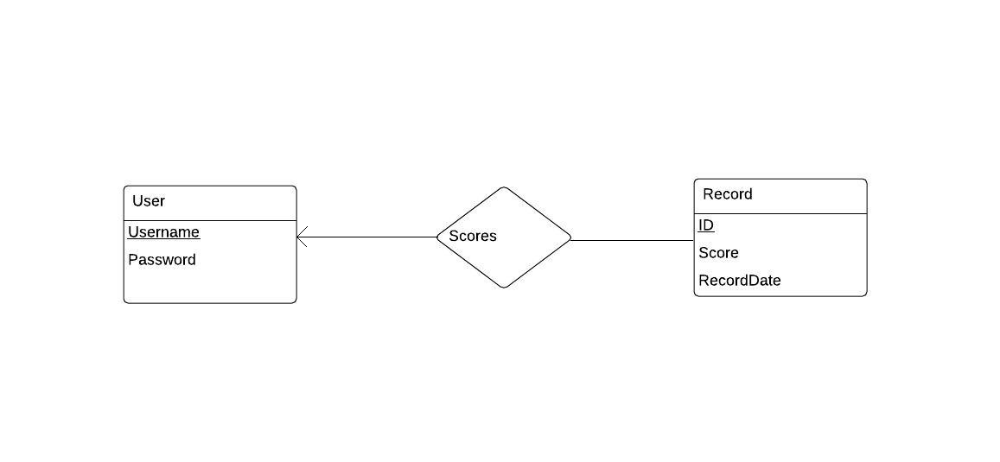

An interactive multiplayer video game as the term project for CEng453: Special Topics in Computer Engineering: Software Construction in 2019-2020 semester.

The users and their scores have one to many relationship.  

Developers:
M. Salih Yılmaz
Ş. Umutcan Üstündaş

[Javadoc Wiki](https://drive.google.com/drive/folders/1Pjp3AMVQakZ147eOjlZUOKy__p7D8bPv?usp=sharing)
